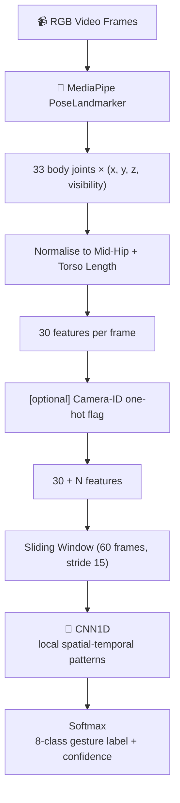
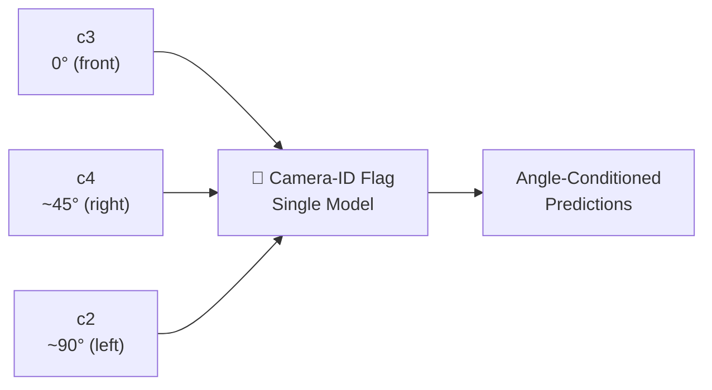
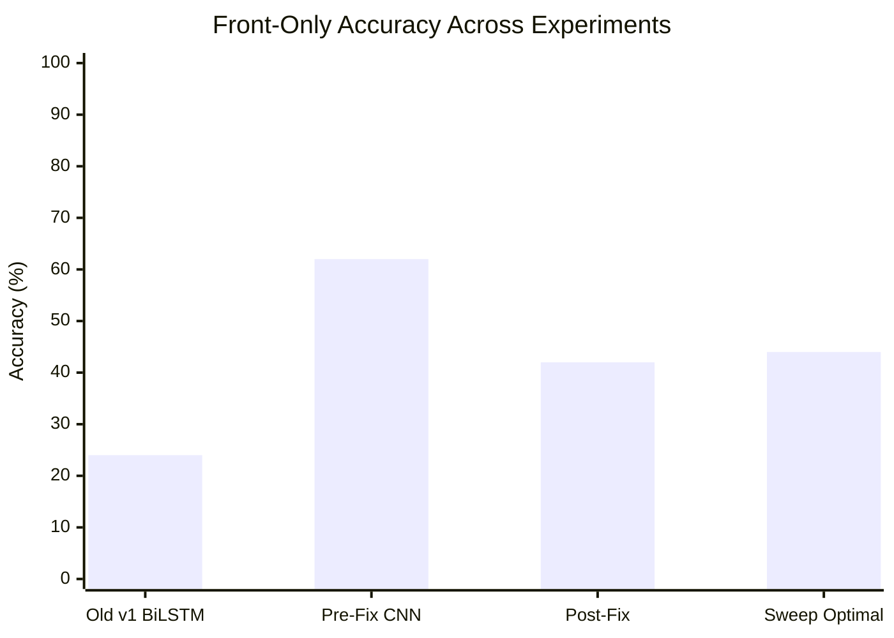
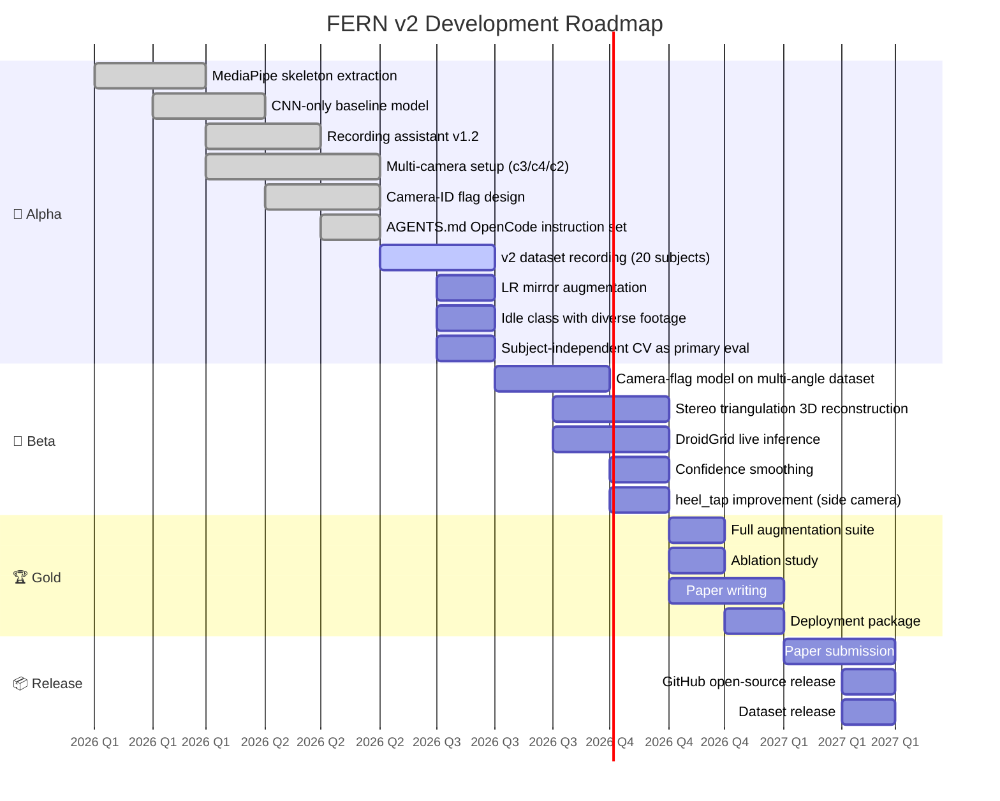

<p align="center">
  
  
  
  
  
  
</p>

<h1 align="center">🦶 FERN v2</h1>
<h3 align="center">Foot & Exercise Recognition Network</h3>

<p align="center">
  Real-time foot gesture recognition from standard RGB cameras.<br />
  <b>MediaPipe skeleton</b> → <b>CNN</b> → <b>8-class gesture classification</b>
</p>

<p align="center">
  <i>~132K parameters · ~20 ms/window on RTX 3070 · Real-time on CPU</i>
</p>

<hr />

## 📋 Table of Contents

- [Architecture](#-architecture)
- [Gestures](#-gestures)
- [Camera Setup](#-camera-setup)
- [Results](#-results)
- [Requirements](#-requirements)
- [Quick Start](#-quick-start)
- [Training Pipeline](#-training-pipeline)
- [Dataset Augmentation Tools](#-dataset-augmentation-tools)
- [DroidGrid Integration](#-droidgrid-integration)
- [Roadmap](#-roadmap)
- [Key Design Decisions](#-key-design-decisions)
- [File Structure](#-file-structure)
- [Citation](#-citation)

---

## 🏗 Architecture



> **Why CNN-only?** BiLSTM with additive attention was evaluated extensively and <b>consistently underperformed</b> at current dataset scale. CNN-only is the proven baseline for FERN v2.

---

## 🦶 Gestures (8 classes)

All gestures are performed with the **right foot**. The model outputs a softmax distribution over these classes every window.

| ID | Class | Description | Typical Confusion |
|:--:|-------|-------------|:-----------------:|
| **0** | `foot_hold` | Standing still / idle — no gesture | transition padding |
| **1** | `foot_lift` 🦵 | Lift foot straight up | — |
| **2** | `sideway_kick` 🦶 | Kick foot laterally | forward_kick |
| **3** | `cross_front` 🦵 | Cross foot in front of body | — |
| **4** | `heel_tap` 👞 | Tap heel to ground | (weak from front) |
| **5** | `flamingo_bend` 🦩 | Single-leg balance with knee bend | foot_hold |
| **6** | `forward_step` 🚶 | Step forward | foot_hold |
| **7** | `forward_kick` ⚽ | Kick forward | sideway_kick |

> **Note:** `foot_hold` serves as the idle/null class to prevent forced predictions on non-gesture frames. It requires dedicated diverse footage — not just transition padding.

---

## 📷 Camera Setup

FERN v2 is designed for **multi-angle capture** with a single-model, camera-conditioned approach.



| Camera | Angle | Position | Status |
|:------:|-------|----------|:------:|
| **c3** | 0° (front) | Ground level | ✅ Training baseline |
| **c4** | ~45° (right) | Ground level | ✅ Active |
| **c2** | ~90° (left) | Ground level | ✅ Active |
| c1 | Elevated | — | ❌ Excluded — breaks hip normalization |
| c5 | — | — | ❌ Excluded — insufficient subjects |

> **Angle conditioning:** A per-frame camera-ID one-hot flag is appended to skeleton features so a single model learns angle-conditioned recognition across all cameras without separate per-camera training.
>
> ⚠️ Geometric rotation via MediaPipe z-depth was evaluated and **failed** (~15% accuracy). Stereo triangulation is designed but requires physical camera calibration.

---

## 📊 Results

<p align="center">
  
  
  
  
</p>



| Metric | Value |
|--------|:-----:|
| Single-split test accuracy | **~80%** |
| 5-fold CV (subject-independent, unbiased) | **~60%** |
| Hyperparameter sweep gain (over baseline) | **+3.25 pp** |
| Optimal config | `cnn_out=128`, `dropout=0.3` |
| Best ONNX train-all accuracy | **86.29%** (front-only) |
| Model parameters | **~132K** (sweep best: 526K) |
| Architecture | **CNN-only** |
| Training device | RTX 3070 Laptop GPU (8 GB) / Ryzen 7 5800H |

**Known weak classes:**
- `heel_tap` — inherently weak from front view; side camera recommended
- `foot_hold` — historically weak when only recorded as transition padding

---

## ⚙️ Requirements

```
🐍 Python      3.11+
🔥 PyTorch     2.2.2 + CUDA 12.1 (CPU-only also supported)
🦴 MediaPipe   0.10.14
👁️ OpenCV      4.9+
🔢 NumPy       1.26.4
🎥 ffmpeg      (for dataset and recording tools)
```

Full dependency list: see [`requirements_v2.txt`](./requirements_v2.txt).

**MediaPipe pose model** (download separately, ~30 MB):

```powershell
# Place the model file at:
C:\Users\<user>\.cache\mediapipe\models\pose_landmarker_heavy.task

# Download URL:
https://storage.googleapis.com/mediapipe-models/pose_landmarker/pose_landmarker_heavy/float16/latest/pose_landmarker_heavy.task
```

> ✅ FERN uses the local `.task` file — **no internet connection required at inference time**.

---

## 🚀 Quick Start

```powershell
# Clone and set up
git clone https://github.com/Vision-Orchestration/FERN
cd FERN
python -m venv venv
.\venv\Scripts\Activate.ps1
pip install -r requirements_v2.txt

# Set PYTHONPATH
$env:PYTHONPATH = "$(Get-Location)\src"

# Live inference (webcam)
python src\infer_v2.py --model models_sweep\fern_v2.onnx --camera_id 0

# Live inference (video file)
python src\infer_v2.py --model models_sweep\fern_v2.onnx --camera_id "path\to\video.mp4"
```

---

## 🎓 Training Pipeline

### 1. Record Dataset (with Recording Assistant)

```powershell
python src\recording_assistant.py
```

The recording assistant provides:
- 🖥️ Fullscreen tkinter UI with countdown / GO / REST cues
- 🎨 Stick-figure gesture illustrations per class
- 📱 DroidGrid REST API integration for multi-camera capture
- 🏷️ Auto-generated label JSONs (eliminates manual annotation)
- 💾 Crash recovery via per-gesture checkpoint saves
- ⏰ Wall-clock anchors (`start_sec` / `end_sec`) for multi-camera sync

**Protocol:** 7 reps × 2 rounds (reverse order), 3 s countdown → 1.5 s GO → 1 s REST.  
Target dataset: **20 subjects**, varied height and footwear.

### 2. Extract Skeletons

```powershell
python src\extract_skeleton.py `
    --video_dir  data\raw `
    --output_dir data\skeletons
```

### 3. Train

```powershell
python src\train_v2.py `
    --skeleton_dir data\skeletons\front `
    --label_dir    data\labels\front `
    --output_dir   models_final_v2 `
    --epochs       200 `
    --warmup_epochs 20 `
    --batch_size   32 `
    --dropout      0.6 `
    --cnn_out      64 `
    --device       cuda `
    --num_workers  0 `
    --train_all
```

### 4. Evaluate

```powershell
# Export to ONNX
python src\export_onnx.py --checkpoint_path models_final_v2\fern_v2_latest.pth --output_path models_final_v2\fern_v2.onnx

# Full-dataset accuracy + confusion matrix
python src\test_onnx.py --onnx_path models_final_v2\fern_v2.onnx --skeleton_dir data\skeletons\front --label_dir data\labels\front --window_size 60 --stride 15
```

### 5. Cross-Validation (Unbiased Estimate)

```powershell
python src\kfold_cv.py --skeleton_dir data\skeletons\front --label_dir data\labels\front --epochs 50 --k_folds 5 --group_by subject --device cuda --num_workers 0
```

---

## 🔧 Dataset Augmentation Tools

### LR Mirror (doubles dataset without re-recording)

```powershell
python src\mirror_10joint.py --skeleton_dir data\skeletons\front --label_dir data\labels\front --camera_id 0
```

> **Important:** Subject-aware splits are required — original and mirrored files share the same subject key and must stay in the same train/val fold to prevent data leakage.

### Import FERN v1 Clips

```powershell
python src\merge_v1_database.py `
    --v1_dir     data\v1_clips `
    --output_dir data\merged_v1 `
    --gap_frames 5
```

Expects `v1_clips/<gesture_name>/<clip_files>`. Outputs merged long videos + auto-generated label JSONs.

---

## 📱 DroidGrid Integration

FERN v2 uses **DroidGrid** as its data capture and live inference delivery layer.

```
📱 Phones        →    🎥 RTSP stream    →    🖥️ MediaMTX broker    →    💻 Laptop server
     │                                                                    │
     └────────────── REST API ─────────────────────────────────────────────┘
```

- Phones stream video via RTSP → MediaMTX broker → laptop server
- FFMPEG pass-through recording per camera
- Recording assistant communicates with DroidGrid REST API to synchronise multi-camera capture
- Live inference output can be overlaid on both laptop and phone displays

See: [Vision-Orchestration/DroidGrid](https://github.com/Vision-Orchestration/DroidGrid)

---

## 🗺️ Roadmap



### Alpha (current)

| Status | Item |
|:------:|------|
| ✅ | MediaPipe skeleton extraction pipeline |
| ✅ | CNN-only model (~132K params, proven baseline) |
| ✅ | Auto-labeling recording assistant (v1.2) with DroidGrid integration |
| ✅ | Multi-camera setup: c3 (front), c4 (45°), c2 (90°) |
| ✅ | Camera-ID one-hot flag design for angle-conditioned single model |
| ✅ | AGENTS.md instruction format for OpenCode agent delegation |
| 🔄 | Fresh v2 dataset recording — 20 subjects, c3 + c4 |
| ⬜ | LR mirror augmentation |
| ⬜ | FERN v1 database merge |
| ⬜ | Idle class (`foot_hold`) with dedicated diverse footage |
| ⬜ | Window onset offset fix (label alignment delay) |
| ⬜ | Subject-independent 5-fold CV as primary evaluation metric |

### Beta

| Status | Item |
|:------:|------|
| ⬜ | Camera-flag model training on multi-angle dataset |
| ⬜ | 3D reconstruction via stereo triangulation (requires physical calibration) |
| ⬜ | DroidGrid phone camera integration for live inference |
| ⬜ | Confidence smoothing (temporal majority vote) |
| ⬜ | `heel_tap` improvement via side-camera data |

### Gold

| Status | Item |
|:------:|------|
| ⬜ | Full augmentation (brightness, mirror, minor rotation) |
| ⬜ | Ablation study: single-cam vs camera-flag fusion vs stereo 3D |
| ⬜ | Paper: methodology, results, related work |
| ⬜ | Deployment package (CPU + GPU, cross-machine tested) |

### Release

| Status | Item |
|:------:|------|
| ⬜ | Paper submission (IEEE Sensors Journal / MDPI Sensors) |
| ⬜ | GitHub open-source release with weights and demo |
| ⬜ | Dataset release (skeleton CSVs, label JSONs) |

---

## 💡 Key Design Decisions

| Decision | Outcome |
|----------|:--------|
| BiLSTM evaluated and dropped | Consistently underperformed at current dataset scale; CNN-only is the baseline |
| MediaPipe z-depth rotation (Phase 1) | ❌ Failed — ~15% accuracy; z is too noisy for single-camera geometric transforms |
| Auto-generated label JSONs | ✅ Strictly better than post-hoc annotation — eliminates labeling error |
| Camera-ID one-hot flag | ✅ Single model learns angle-conditioned recognition; avoids training separate per-camera models |
| Stereo triangulation (Phase 2) | 🔲 Designed; requires physical calibration before implementation |
| Early stopping warmup guard | ✅ Required — val_loss vs val_acc mismatch caused false early stops without it |

---

## 📁 File Structure

```
FERN/
├── src/
│   ├── model_v2.py              # CNN-only architecture
│   ├── dataset_v2.py            # Sliding window dataset with camera-flag support
│   ├── train_v2.py              # Training loop with cosine LR + early stopping
│   ├── kfold_cv.py              # K-fold cross-validation with subject grouping
│   ├── test_onnx.py             # ONNX Runtime evaluation + confusion matrix
│   ├── export_onnx.py           # PyTorch → ONNX export with numerical validation
│   ├── infer_onnx.py            # ONNX Runtime streaming inference
│   ├── infer_v2.py              # Live inference (webcam or video file)
│   ├── recording_assistant.py   # Recording UI with DroidGrid integration
│   ├── extract_skeleton.py      # MediaPipe PoseLandmarker extraction
│   ├── mirror_10joint.py        # LR skeleton augmentation
│   ├── add_foot_hold_gaps.py    # Insert idle frames at gesture transitions
│   └── add_camera_id.py         # Attach camera-ID metadata to label JSONs
├── data/
│   ├── raw/                     # Raw videos (not tracked)
│   ├── skeletons/
│   │   ├── front/               # Front-camera (c3) skeleton CSVs
│   │   └── front_plus_45/       # Multi-angle (c3 + c2) skeleton CSVs
│   └── labels/
│       ├── front/               # Front-camera label JSONs
│       └── front_plus_45/       # Multi-angle label JSONs with camera_id
├── models_final/                # Old v1 front-only model (62.58% ONNX)
├── models_final_v2/             # Phase 1 camera-flag model (50.48% ONNX)
├── models_sweep/                # Hyperparameter sweep optimal (86.29% ONNX)
├── AGENTS.md                    # OpenCode agent instruction document
├── CAMERA_FLAG_AGENT.md         # Camera-flag implementation instructions
├── FERN_v2_COMPLETE_REPORT.md   # Full technical report with all experiments
├── run_nightly.ps1              # Nightly training run script (PowerShell)
├── requirements_v2.txt
└── README.md
```

---

## 📖 Citation

```bibtex
@misc{fern2026,
  title   = {FERN: Real-Time Foot Gesture Recognition via MediaPipe Skeleton and CNN},
  author  = {Vision-Orchestration},
  year    = {2026},
  url     = {https://github.com/Vision-Orchestration/FERN}
}
```

---

## 📄 License

<p align="center">
  
</p>

```
MIT License — Copyright (c) 2026 Vision-Orchestration

Permission is hereby granted, free of charge, to any person obtaining a copy
of this software and associated documentation files (the "Software"), to deal
in the Software without restriction, including without limitation the rights
to use, copy, modify, merge, publish, distribute, sublicense, and/or sell
copies of the Software, and to permit persons to whom the Software is
furnished to do so, subject to the following conditions...

The above copyright notice and this permission notice shall be included in all
copies or substantial portions of the Software.
```

---

<p align="center">
  <sub>Built with 🔥 PyTorch · 🦴 MediaPipe · ⚡ ONNX Runtime</sub>
  <br />
  <sub>Vision-Orchestration © 2026</sub>
</p>
