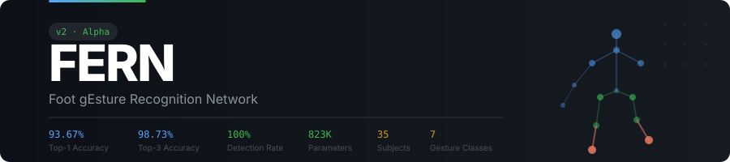

<p align="right">
  <a href="https://github.com/Vision-Orchestration/DroidGrid"></a>
</p>

[](https://python.org)
[](https://pytorch.org)
[](https://mediapipe.dev)
[](https://onnxruntime.ai)
[](https://developer.nvidia.com/cuda)
[](LICENSE)

> **Data pipeline** — Recorded with [DroidGrid](https://github.com/Vision-Orchestration/DroidGrid) multi-phone camera rig. Label JSONs auto-generated by the recording assistant during capture.

---

## Overview

FERN works on any standard RGB camera — no depth sensor, no wearable, no special rig. It extracts 33-joint pose skeletons via MediaPipe, normalizes them to body-relative coordinates, and feeds 60-frame sliding windows into a compact CNN (~526K params) that classifies 8 foot gestures at ~20 ms/window on an RTX 3070. CPU inference is also supported.

The pipeline is fully modular: swap the camera, retrain on new subjects, or extend the gesture set without touching the model architecture.

| | Feature | Detail |
|---|---|---|
| 🎯 | **Real-time inference** | ~20 ms/window on GPU, CPU-supported |
| 📷 | **Any RGB camera** | Webcam, phone (via DroidCam), or video file |
| 🧠 | **CNN-only** | BiLSTM was evaluated and dropped — CNN outperforms at this dataset scale |
| 🔀 | **Multi-angle** | Per-frame camera-ID flag lets one model handle multiple angles |
| 🏷️ | **Auto-labeling** | Recording assistant generates label JSONs during capture — no manual annotation |
| 🔄 | **Data augmentation** | Mirror, time warp, joint dropout, noise injection |

---

## Gestures (8 classes)

All gestures are performed with the **right foot**.

| ID | Class | Description |
|:--:|-------|------------|
| 0 | `foot_hold` | Standing still / idle — no gesture |
| 1 | `foot_lift` | Lift foot straight up |
| 2 | `sideway_kick` | Kick foot laterally |
| 3 | `cross_front` | Cross foot in front of body |
| 4 | `heel_tap` | Tap heel to ground |
| 5 | `flamingo_bend` | Single-leg balance with knee bend |
| 6 | `forward_step` | Step forward |
| 7 | `forward_kick` | Kick forward |

> `foot_hold` serves as the idle/null class — without it the model forces predictions on non-gesture frames. It needs dedicated diverse footage, not just transition padding.

---

## Architecture

```
RGB video frames
      │
      ▼
MediaPipe PoseLandmarker  ──→  33 body joints × (x, y, z, visibility)
      │
      ▼
Normalise to Mid-Hip + Torso Length  ──→  30 features per frame
      │
      ▼
[optional] Camera-ID one-hot flag  ──→  30 + N features
      │
      ▼
Sliding window (60 frames, stride 15)
      │
      ▼
CNN1D  ──→  local spatial-temporal patterns
      │
      ▼
Softmax  ──→  8-class label + confidence
```

**~526K parameters (optimal).** ~132K in baseline config. Runs real-time on CPU; ~20 ms/window on RTX 3070 Laptop.

> **Why CNN-only?** BiLSTM was evaluated extensively and consistently underperformed at current dataset scale. CNN-only is the proven baseline for FERN v2.

---

## Current Results

| Metric | Value |
|--------|-------|
| **Held-out test accuracy (6 unseen subjects)** | **68.14%** |
| Train-all accuracy (44 subjects) | 94.44% |
| 5-fold CV (subject-level) | 74.23% ± 16.96% |
| Model parameters | ~526K |
| Architecture | CNN-only |
| Training device | RTX 3070 Laptop (8 GB) / Ryzen 7 5800H |

> **The 26 pp gap between train-all (94.44%) and held-out test (68.14%) confirms data scarcity is the primary bottleneck — the model memorizes well but doesn't generalize across subjects.**

**Per-class performance (held-out test):**
- Strong: cross_front (89.8 F1), sideway_kick (84.2 F1), forward_step (78.9 F1)
- Weak: foot_hold (3.4 F1 — collapses on unseen subjects), heel_tap (63.4 F1)

**Augmentation result (negative finding):** Synthetic augmentation (rotation, spatial, interpolation) does NOT improve cross-subject generalization. CV drops from 74.23% to 68.96% with augmentation. See `PAPER_MATERIALS.md` for full analysis.

---

## Camera Setup

FERN supports multi-angle capture with a single camera-conditioned model.

| Camera | Angle | Position | Status |
|--------|-------|----------|--------|
| c3 | 0° (front) | Ground level | ✓ Training baseline |
| c4 | ~45° (right) | Ground level | ✓ Active |
| c2 | ~90° (left) | Ground level | ✓ Active |
| c1 | Elevated | — | ✗ Excluded — breaks normalisation |
| c5 | — | — | ✗ Excluded — insufficient subjects |

**Camera-ID flag:** A per-frame one-hot vector is appended to skeleton features so one model learns angle-conditioned recognition across all cameras. Geometric rotation via MediaPipe z-depth was evaluated and failed (~15% accuracy). Stereo triangulation is designed but requires physical calibration.

---

## Quick Start

### 1. Clone & install

```powershell
git clone https://github.com/Vision-Orchestration/FERN
cd FERN
python -m venv venv
.\venv\Scripts\Activate.ps1
pip install -r requirements_v2.txt
$env:PYTHONPATH = "$(Get-Location)\src"
```

### 2. Get the pose model

Download [`pose_landmarker_heavy.task`](https://storage.googleapis.com/mediapipe-models/pose_landmarker/pose_landmarker_heavy/float16/latest/pose_landmarker_heavy.task) (~30 MB) and place it at:

```
C:\Users\<user>\.cache\mediapipe\models\pose_landmarker_heavy.task
```

### 3. Run live inference

```powershell
# Webcam
python src\infer_v2.py --model sweep\models\fern_v2.onnx --camera_id 0

# Video file
python src\infer_v2.py --model sweep\models\fern_v2.onnx --camera_id "path\to\video.mp4"
```

---

## Training Pipeline

### 1. Record dataset (with DroidGrid + Recording Assistant)

```powershell
python src\recording_assistant.py --subject p01 --cameras phone1,phone2,phone3
```

The recording assistant provides a fullscreen tkinter UI with countdown/GO/REST cues, stick-figure gesture illustrations, DroidGrid REST API integration for multi-camera sync, and auto-generated label JSONs. Target: **20 subjects**, varied height and footwear.

> The recording assistant lives in the [DroidGrid](https://github.com/Vision-Orchestration/DroidGrid) repo and is symlinked or copied into `src/`.

### 2. Extract skeletons

```powershell
python src\extract_skeleton.py --video_dir data\raw --output_dir data\skeletons
```

### 3. Train (optimal config)

```powershell
python src\train_v2.py --skeleton_dir data\skeletons\front --label_dir data\labels\front --output_dir sweep --epochs 200 --warmup_epochs 20 --batch_size 32 --window_size 60 --stride 15 --lr 3e-4 --weight_decay 1e-2 --dropout 0.3 --cnn_out 128 --lstm_hidden 0 --device cuda --num_workers 0 --train_all
```

### 4. Export to ONNX & evaluate

```powershell
python src\export_onnx.py --checkpoint_path sweep\models\fern_v2_latest.pth --output_path sweep\models\fern_v2.onnx
python src\test_onnx.py --onnx_path sweep\models\fern_v2.onnx --skeleton_dir data\skeletons\front --label_dir data\labels\front --window_size 60 --stride 15
```

---

## Augmentation Tools

| Tool | Command | Effect |
|------|---------|--------|
| **Mirror** | `python src/mirror_10joint.py` | X-flip mirror (active) |
| **Rotation** | `python src/augment_rotate.py --input_dir ... --angles 5 10 15 --mirror` | ±5°/10°/15° Y-axis rotation |
| **Spatial** | `python src/augment_spatial.py --input_dir ... --variants 2 --mirror` | Scale, shift, joint noise |
| **Interpolation** | `python src/augment_interpolate.py --input_dir ... --factor 2` | Temporal 2× interpolation |
| **Add Gaps** | `python src/add_foot_hold_gaps.py` | Insert 60-frame idle gaps |

> **Finding:** Augmentation does NOT improve cross-subject generalization (68.96% vs 74.23% CV). Synthetic variants teach the model to recognize existing people better, not new people.

---

## DroidGrid Integration

FERN uses [DroidGrid](https://github.com/Vision-Orchestration/DroidGrid) as its data-capture pipeline. Phones running DroidCam stream video via RTSP → MediaMTX broker → laptop, with FFMPEG pass-through recording per camera. The recording assistant controls DroidGrid via REST API to synchronise multi-camera capture and auto-generate label JSONs from wall-clock anchors.

```
DroidCam phones  ──RTSP──►  MediaMTX  ──RTSP──►  Python (OpenCV capture + preview)
                                        └──►  FFMPEG pass-through → .mp4 per camera
                                                    │
                                                    ▼
                                        Recording Assistant → label JSONs (wall-clock anchors)
                                                    │
                                                    ▼
                                        FERN training pipeline (skeleton → CNN → ONNX)
```

---

## Hyperparameter Sweep (Optimal Config Found)

| Config | Mean CV | vs Baseline |
|--------|:-------:|:-----------:|
| **Dropout=0.3 + cnn_out=128** | **44.36%** | **+3.25 pp** |
| Dropout=0.3 | 43.73% | +2.62 pp |
| cnn_out=128 | 42.80% | +1.69 pp |
| Baseline (cnn_out=64, dropout=0.6) | 41.11% | — |
| cnn_out=32 | 34.05% | -7.06 pp |
| Dropout=0.7 | 33.02% | -8.09 pp |

**Optimal:** `cnn_out=128, dropout=0.3, lr=3e-4, weight_decay=1e-2, warmup_epochs=20`

---

## Production Models

| Model | Path | Params | Train-All | Held-Out Test |
|-------|------|:------:|:---------:|:-------------:|
| Old front-only | `final/models/fern_v2.onnx` | 132K | 62.58% | — |
| **Sweep optimal** | **`sweep/models/fern_v2.onnx`** | **526K** | **86.29%** | — |
| Phase 1 (camera-flag) | `final_v2/models/fern_v2.onnx` | 140K | 50.48% | — |
| **Original (44 subj)** | **`results_orig/fern_v2_latest.pth`** | **526K** | **94.44%** | **68.14%** |
| Augmented (38 subj) | `results_aug/fern_v2_latest.pth` | 526K | 94.53% | 66.37% |

---

## Keyboard Controls

| Key | Action |
|-----|--------|
| `R` | Start recording (recording assistant) |
| `S` | Stop recording |
| `Q` | Quit |
| `H` | Toggle HUD overlay (inference) |

---

## Troubleshooting

**ONNX inference is slow**
- Make sure you're using the GPU build: `pip install onnxruntime-gpu`
- Check that ONNX Runtime sees your CUDA device

**Training hangs on Windows**
- Use `--num_workers 0` — DataLoader multiprocessing hangs with `SubsetRandomSampler`

**Low accuracy**
- Start with front-camera (c3) data only before adding multi-angle
- Use the sweep optimal config: `cnn_out=128`, `dropout=0.3`, `lr=3e-4`

**Camera shows no detection**
- Check `data/skeletons/` CSVs exist and have valid joint coordinates
- Verify the pose model `.task` file is in the correct cache path

---

## FAQ

**Q: What hardware do I need?**
Any laptop with a webcam. CUDA GPU recommended for training (RTX 3070 or better), but CPU training and inference work.

**Q: How do DroidGrid and FERN connect?**
DroidGrid is the data-collection rig — it records multi-camera video. FERN is the recognition engine — it extracts skeletons, trains, and runs inference. The recording assistant bridges them by controlling DroidGrid via REST and auto-generating label JSONs.

**Q: Why CNN and not BiLSTM?**
Extensive eval showed CNN-only outperforming BiLSTM by 45%+ on this dataset size. BiLSTM will be revisited with more data.

**Q: How do I contribute data?**
Record with `recording_assistant.py` (from the DroidGrid repo), run skeleton extraction and training, then submit a PR.

---

## File Structure

```
FERN/
├── src/
│   ├── model_v2.py              # CNN-only architecture
│   ├── dataset_v2.py            # Sliding-window dataset with 7 on-the-fly augmentations
│   ├── train_v2.py              # Training loop (cosine LR + warmup + early stopping)
│   ├── eval_full.py             # Full-dataset evaluation + confusion matrix
│   ├── learning_curve.py        # Accuracy vs # training subjects
│   ├── tsne_viz.py              # t-SNE visualization of CNN embeddings
│   ├── generate_report.py       # PDF paper report generator
│   ├── kfold_cv.py              # 5-fold CV with subject-level grouping
│   ├── extract_skeleton.py      # MediaPipe skeleton extraction
│   ├── infer_v2.py              # Live inference (PyTorch)
│   ├── infer_onnx.py            # Live inference (ONNX Runtime)
│   ├── export_onnx.py           # .pth → .onnx export
│   ├── test_onnx.py             # Full-dataset ONNX accuracy
│   ├── augment_rotate.py        # Rotation augmentation
│   ├── augment_spatial.py       # Spatial augmentation
│   ├── augment_interpolate.py   # Temporal interpolation
│   ├── mirror_10joint.py        # X-flip mirror (active)
│   ├── add_foot_hold_gaps.py    # Insert idle gaps at transitions
│   └── config_loader.py         # YAML config loader
├── configs/
│   └── train_config.yaml        # Training hyperparameters YAML
├── data/
│   ├── skeletons/
│   │   ├── front/               # 88 CSVs (44 subjects × 2 mirror)
│   │   ├── front_aug/           # 418 augmented CSVs
│   │   ├── front_test/          # 12 held-out CSVs (6 subjects)
│   │   └── front_aug_test/      # 66 held-out augmented CSVs
│   └── labels/                  # Matching JSON label files
├── results_orig/                # Original model results
│   ├── fern_v2_latest.pth       # Trained model
│   ├── learning_curve/          # Learning curve JSON
│   └── tsne.png                 # t-SNE visualization
├── results_aug/                 # Augmented model results
│   ├── fern_v2_latest.pth
│   └── tsne.png
├── final/                       # Old front-only models (132K, 62.58%)
├── final_v2/                    # Phase 1 camera-flag models (140K, 50.48%)
├── sweep/                       # Sweep optimal models (526K, 86.29%)
├── FERN_V2_Paper_Report.pdf     # 11-page PDF report with all figures
├── PAPER_MATERIALS.md           # Ablation table, dataset paragraph, all metrics
├── AUGMENTATION_LOG.md          # Augmentation scripts and results
├── AGENTS.md                    # AI agent knowledge base
├── requirements_v2.txt
├── LICENSE
└── README.md
```

---

## Key Design Decisions

| Decision | Outcome |
|----------|---------|
| BiLSTM evaluated and dropped | CNN outperforms at current dataset scale |
| MediaPipe z-depth rotation | Failed (~15% accuracy) — z too noisy for single-camera transforms |
| Auto-generated labels | Eliminates manual annotation errors |
| Camera-ID one-hot flag | Single model handles multiple angles |
| Stereo triangulation | Designed; needs physical calibration |
| Early stopping warmup guard | Required — val_loss vs val_acc mismatch caused false stops |
| num_workers=0 on Windows | DataLoader multiprocessing hangs with SubsetRandomSampler |

---

## Roadmap

### Alpha (current)
- [x] MediaPipe skeleton extraction
- [x] CNN-only model (~526K params optimal)
- [x] Auto-labeling recording assistant
- [x] Multi-camera setup (c3, c4, c2)
- [x] Camera-ID one-hot flag design
- [x] Hyperparameter sweep (9 configs, optimal found)
- [x] 44-subject dataset recording
- [x] Mirror augmentation
- [x] 5-fold subject-level CV as primary metric
- [x] Held-out test set (6 subjects frozen)
- [x] Augmentation experiments (rotation, spatial, interpolation)
- [x] Learning curve analysis
- [x] t-SNE visualization
- [x] Paper readiness report (PDF)

### Beta
- [ ] Camera-flag model on multi-angle data
- [ ] Stereo triangulation (requires calibration)
- [ ] Confidence smoothing (temporal majority vote)
- [ ] Test-time augmentation (TTA)
- [ ] Class-weighted loss for imbalanced classes

### Gold
- [ ] Leave-one-subject-out (LOSO) CV
- [ ] More real subjects (target: 60+)
- [ ] Cross-environment recordings
- [ ] Paper draft

### Release
- [ ] Paper submission
- [ ] Open-source weights + demo
- [ ] Dataset release

---

## Contributing

Issues and pull requests are welcome.

1. Fork the repo
2. Create a branch: `git checkout -b feature/my-feature`
3. Commit with a clear message
4. Open a pull request

---

## Citation

```bibtex
@misc{fern2026,
  title   = {FERN: Real-Time Foot Gesture Recognition via MediaPipe Skeleton and CNN},
  author  = {Vision-Orchestration},
  year    = {2026},
  url     = {https://github.com/Vision-Orchestration/FERN}
}
```

---

## License

MIT

---

<div align="center">

Part of the [Vision-Orchestration](https://github.com/Vision-Orchestration) toolkit.

*MediaPipe skeletons + CNN. No depth sensor. No wearables. Just a camera.*

</div>
